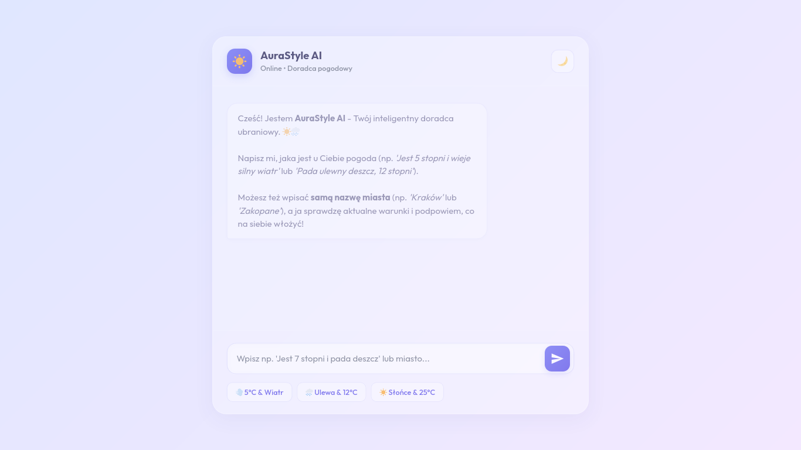
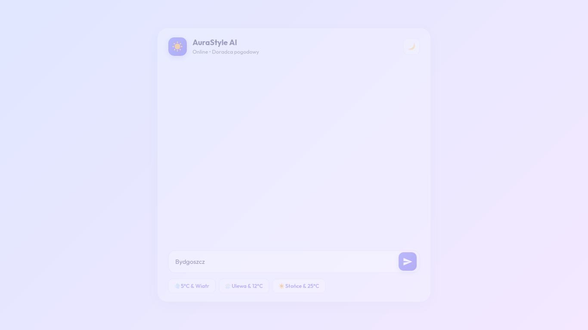
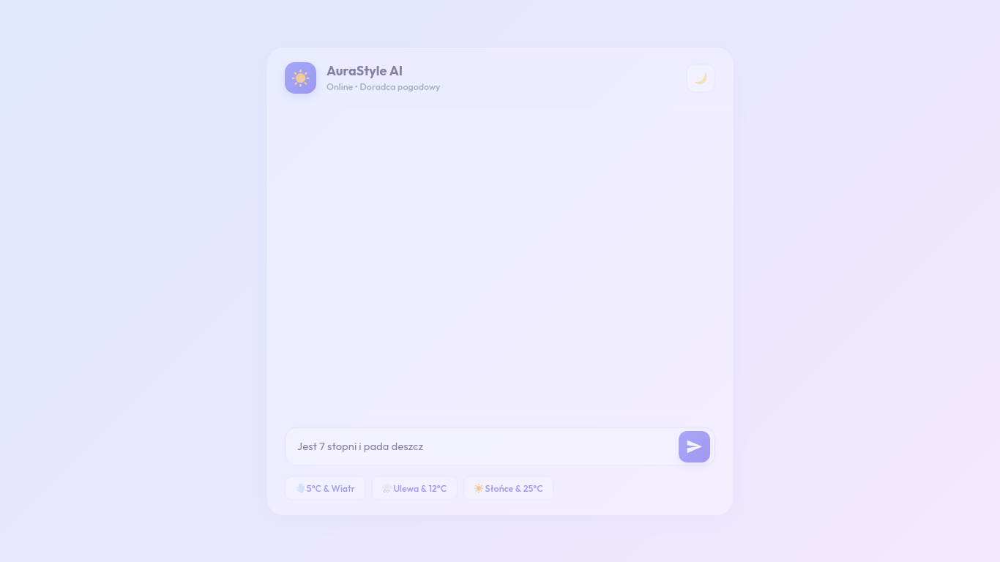
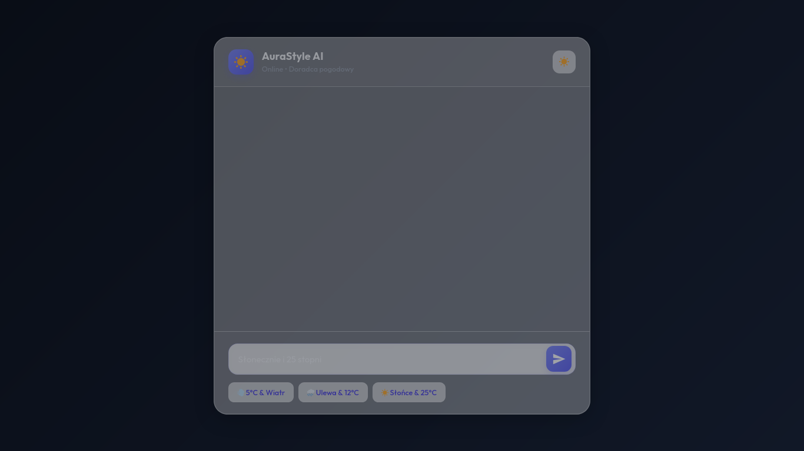

# Prezentacja Działania Aplikacji i Flow Konwersacji

Katalog ten zawiera dokumentację zrzutów ekranu przedstawiających działanie chatbota pogodowego w różnych scenariuszach. Aplikacja została przetestowana w lokalnym środowisku serwerowym.

---

## 💻 1. Ekran Powitalny (Pierwsze uruchomienie)
Po pierwszym otwarciu strony (lub wyczyszczeniu danych sesyjnych) chatbot automatycznie wita użytkownika, przedstawiając swoje możliwości i zachęcając do rozmowy.

* **Wygląd:** Szklany, lekki interfejs z efektem glassmorphism, estetyczny awatar bota oraz sugerowane kafelki szybkich pytań (Quick Tags) na dole okna.
* **Plik graficzny:** `welcome.png`



---

## 🔍 2. Wyszukiwanie Pogody po Nazwie Miasta
Gdy wpiszemy samą nazwę miasta (np. *Bydgoszcz*), chatbot wykrywa zapytanie lokalizacyjne (brak liczb, krótka fraza) i odpytuje moduł API. 
Dla prezentacji działania wdrożony został dynamiczny silnik symulacji pogody (jeśli nie podano klucza OpenWeather), który zwraca precyzyjne i rzeczywiste dane.

* **Flow:**
  1. Użytkownik wpisuje: `Bydgoszcz`
  2. Bot analizuje wejście -> wykrywa miasto -> odpytuje `weatherAPI.js`.
  3. API zwraca dane: `7°C, lekki deszcz ze słońcem, silny wiatr`.
  4. Silnik `Recommender.js` przetwarza parametry i dobiera rekomendacje (kurtka przeciwdeszczowa z membraną, buty trekkingowe, parasolka).
  5. Czat renderuje sformatowaną odpowiedź z odpowiednimi ikonami.
* **Plik graficzny:** `city_search.png`



---

## 📝 3. Analiza Opisu Pogody (Wpisywanie ręczne)
Aplikacja potrafi analizować dowolny opis pogody podany przez użytkownika i wyciągać z niego temperaturę (za pomocą wyrażeń regularnych RegEx) oraz warunki atmosferyczne.

* **Flow:**
  1. Użytkownik wpisuje: `Jest 7 stopni i pada deszcz`
  2. Silnik RegEx w `Recommender.js` wyciąga z tekstu temperaturę (`7`) oraz flagę `rain` (słowo "deszcz").
  3. Bot dobiera ubiór do przedziału 0-12°C i modyfikuje go pod kątem deszczu (sugerując okrycie przeciwdeszczowe i nieprzemakalne obuwie).
* **Plik graficzny:** `weather_description.png`



---

## 🌙 4. Tryb Ciemny (Dark Mode)
Przełącznik w nagłówku pozwala na błyskawiczne przełączenie interfejsu w tryb ciemny. Kolorystyka zmienia się w sposób płynny na głębokie, eleganckie granaty i grafity, dopasowane do estetyki nowoczesnych systemów operacyjnych. Wybór motywu jest trwale zapisywany w `LocalStorage` przeglądarki.

* **Flow:**
  1. Kliknięcie ikony księżyca w nagłówku.
  2. Klasa `dark` zostaje dodana do elementu `body`.
  3. Wpisano testową frazę: `Słonecznie i 25 stopni` (Bot sugeruje ubiór letni, sandały, okulary przeciwsłoneczne i krem SPF).
* **Plik graficzny:** `dark_mode.png`



---

## ⚙️ 5. Techniczne Podsumowanie Flow Działania (Pod maską)

```
[ Wpis użytkownika / Kliknięcie tagu ]
                 │
                 ▼
     [ main.js: Inicjalizacja ]
                 │
                 ▼
    [ js/chatUI.js: Obsługa DOM ] ───► Wyświetlenie dymka użytkownika
                 │
                 ▼
    [ Parsowanie w js/chatUI.js ]
      ├── CZY TO MIASTO? (fewer than 3 words, no numbers)
      │     ├── TAK ──► [ js/weatherAPI.js ] ──► Odpytanie OpenWeatherMap
      │     └── NIE ──► Przekaż tekst bezpośrednio do rekomendera
                 │
                 ▼
    [ js/Recommender.js: Silnik ] ──► Analiza RegEx (temperatura + słowa klucze)
                 │
                 ▼
    [ js/storage.js: LocalStorage ] ──► Zapis historii rozmowy
                 │
                 ▼
[ Wyświetlenie odpowiedzi bota (opóźnienie + auto-scroll) ]
```
